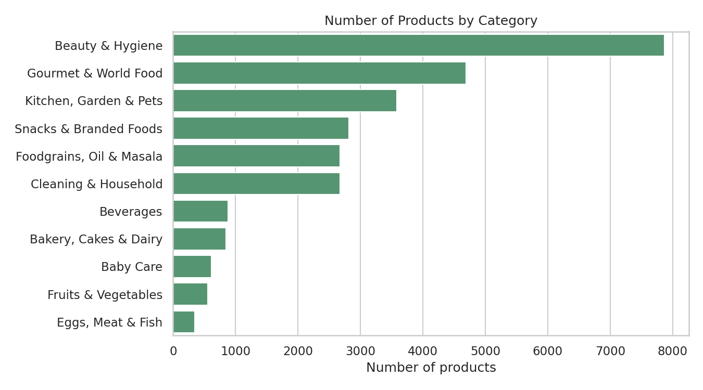
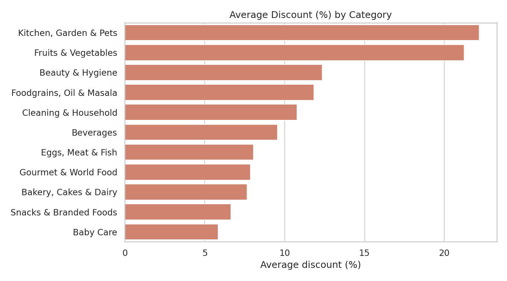
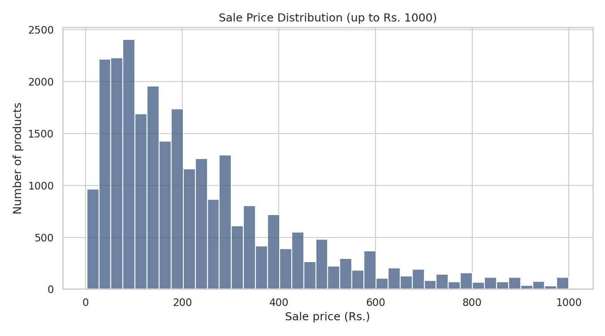

# BigBasket Product Analysis

Exploratory data analysis of BigBasket's product catalogue using **Python, Pandas, NumPy, Matplotlib and Seaborn**. The Repo also includes foundational notebooks that build up the techniques used in the analysis.


## Objective

Understand the BigBasket product catalogue by exploring pricing, categories, brands and ratings and present the findings through clear visualizations.

## Dataset

`data/BigBasket_Products.csv`

- **Size:** 27,555 products x 10 columns
- **Columns:** `index`, `product`, `category`, `sub_category`, `brand`, `sale_price`, `market_price`, `type`, `rating`, `description`
- **Coverage:** 11 categories, 90 sub-categories, 426 product types and 2,313 brands
- **Data quality:** 8,626 products (31.3%) have no rating and 115 have no description. No row has a sale price higher than its market price.

## Key Insights

- **Beauty & Hygiene is the largest category** with 7,867 products (28.6% of the catalogue). The top 3 categories (Beauty & Hygiene, Gourmet & World Food, Kitchen/Garden/Pets) make up 58.6% of all products.
- **55.3% of products are sold at a discount.** Among discounted items the average discount is 21.4%, and across the whole catalogue it is 11.8%.
- **Discounts vary a lot by category.** Kitchen, Garden & Pets (22.2%) and Fruits & Vegetables (21.2%) have the highest average discounts, while Baby Care (5.9%) and Snacks & Branded Foods (6.6%) have the lowest.
- **Prices are right-skewed.** The average sale price is Rs. 322.5 but the median is only Rs. 190, because a few premium items go up to Rs. 12,500.
- **Ratings are generally high.** The average rating is 3.94, and 65.3% of rated products have 4.0 or above.
- **Price and rating are almost unrelated** (correlation -0.08), so a higher price does not mean a better rating. Budget products (under Rs. 100) even average a higher rating (4.03) than premium products of Rs. 1000 and above (3.75).
- **Fresho is the most common brand** (638 products), followed by bb Royal (539) and BB Home (428).

## Visualizations

### Products by category


### Average discount by category


### Sale price distribution


## Notebooks

| # | Notebook | Purpose |
|---|----------|---------|
| 1 | [NumPy Basics](notebooks/01_numpy_basics.ipynb) | Arrays, indexing, filtering, statistics, and NumPy on the BigBasket data |
| 2 | [Pandas Data Analysis](notebooks/02_pandas_data_analysis.ipynb) | Data cleaning, filtering, grouping and EDA on BigBasket data |
| 3 | [Matplotlib Visualization](notebooks/03_matplotlib_visualization.ipynb) | Line, bar, histogram, box and scatter plots |
| 4 | [Seaborn Visualization](notebooks/04_seaborn_visualization.ipynb) | Distribution and relationship plots |
## Getting Started

```bash
git clone https://github.com/ABHAYMARWADE2004/Bigbasket-Product-Analysis.git
cd Bigbasket-Product-Analysis

pip install -r requirements.txt
jupyter notebook
```

Open the notebooks from the `notebooks/` folder. They find the dataset in `data/` automatically.

## Project Structure

```
Bigbasket-Product-Analysis/
├── data/
│   └── BigBasket_Products.csv
├── images/
│   ├── products_by_category.png
│   ├── discount_by_category.png
│   └── price_distribution.png
├── notebooks/
│   ├── 01_numpy_basics.ipynb
│   ├── 02_pandas_data_analysis.ipynb
│   ├── 03_matplotlib_visualization.ipynb
│   └── 04_seaborn_visualization.ipynb
├── requirements.txt
└── README.md
```

## Tech Stack

Python · Jupyter Notebook · NumPy · Pandas · Matplotlib · Seaborn

## Skills Demonstrated

Data cleaning · Exploratory data analysis (EDA) · Data manipulation · Data visualization · Insight storytelling

## Author

**Abhay Marwade**

Aspiring Data Analyst

[GitHub](https://github.com/ABHAYMARWADE2004)
